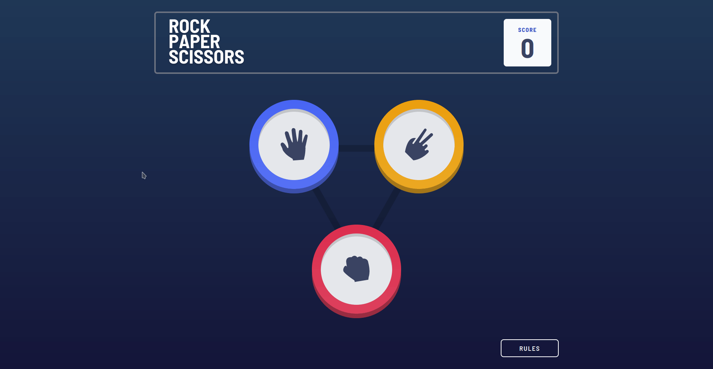
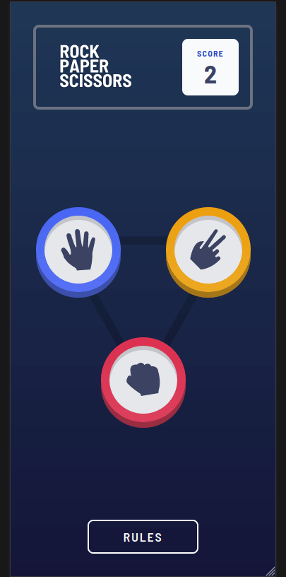

# Frontend Mentor - Rock, Paper, Scissors solution

This is a solution to
the [Rock, Paper, Scissors challenge on Frontend Mentor](https://www.frontendmentor.io/challenges/rock-paper-scissors-game-pTgwgvgH).
Frontend Mentor challenges help you improve your coding skills by building realistic projects.

## Table of contents
-   [Table of contents](#table-of-contents)
-   [Overview](#overview)
    -   [The challenge](#the-challenge)
    -   [Screenshot](#screenshot)
        -   [Desktop Design](#desktop-design)
        -   [Mobile Design](#mobile-design)
    -   [Links](#links)
-   [My process](#my-process)
    -   [Built with](#built-with)
    -   [What I learned](#what-i-learned)
-   [Author](#author)

## Overview

### The challenge

Users should be able to:

- View the optimal layout for the game depending on their device's screen size
- Play Rock, Paper, Scissors against the computer
- Maintain the state of the score after refreshing the browser _(optional)_
- **Bonus**: Play Rock, Paper, Scissors, Lizard, Spock against the computer _(optional)_

### Screenshot

#### Desktop Design

  

#### Mobile Design

	 

### Links

-   Solution URL: [https://github.com/gargujjwal/Frontend-Mentors-rock-paper-scissors-solution](https://github.com/gargujjwal/Frontend-Mentors-rock-paper-scissors-solution)
-   Live Site URL: [https://gargujjwal.github.io/Frontend-Mentors-rock-paper-scissors-solution/](https://gargujjwal.github.io/Frontend-Mentors-rock-paper-scissors-solution/)

## My process

### Built with

-   Mobile-first workflow
-   [Typescript](https://www.typescriptlang.org/)
-   [React](https://reactjs.org/) - JS library
-   [Vite](https://vitejs.dev/)
-   [Tailwind](https://tailwindcss.com/) - CSS Framework

## Author

-   Website - [Ujjwal Garg](https://github.com/gargujjwal)
-   Frontend Mentor - [@gargujjwal](https://www.frontendmentor.io/profile/gargujjwal)
-   Instagram - [@gargujjwal](https://www.instagram.com/gargujjwal/)
-   Linkedin - [@gargujjwal](https://www.linkedin.com/in/ujjwal-garg-3a5639243/)
-   Twitter -[@UjwalGarg100204](https://twitter.com/UjwalGarg100204)
